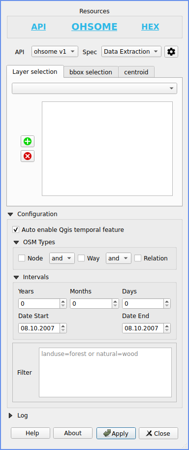

## Development ##
Before adding new commits make sure pre-commit is installed `https://pre-commit.com#install` and the following commands are executed inside the repository:
```
pre-commit clean
pre-commit install
pre-commit install-hooks
```
Before commiting run the hooks on all files:
```
pre-commit run --all-files
```

## General
This is a really early version of a Ohsome QGIS Plugin and not expected to work properly in a productive environment!

For Information about Ohsome: https://heigit.org/big-spatial-data-analytics-en/ohsome/


## Requirements
Python >= 3.8
QGIS >= 3.14

## Ohsome QGIS Plugin
This Plugin supports an early implementation of the `data extraction` API.
The minimal required QGIS version is 3.14 because this plugin uses the new build-in temporal feature support.


