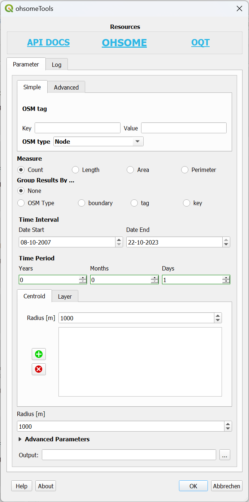
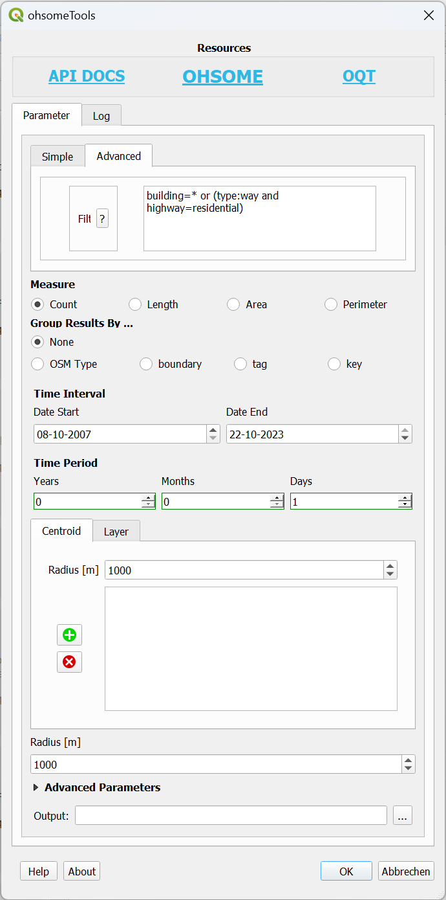
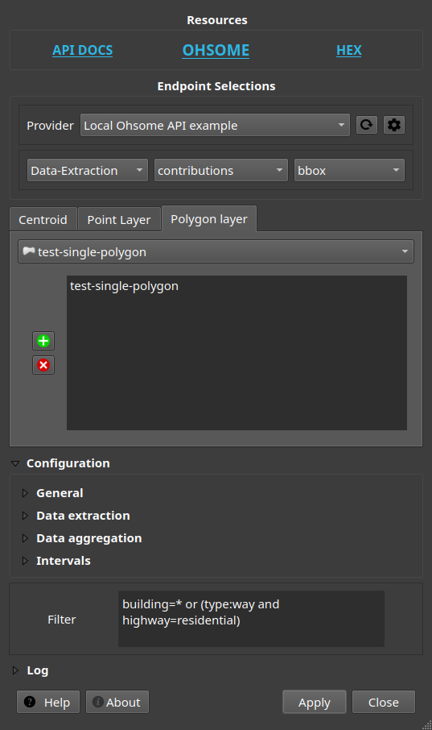

# Ohsome QGIS Plugin

Per default the QGIS native temporal feature (version >= 3.14) is activated, if the result contains suitable geometries.

The Temporal Controller can be accessed via `View` -> `Panels` -> `Temporal Controller`.





**Note, only QGIS >= v3.14 is supported.**

Set of tools to use the [OHSOME](https://heigit.org/big-spatial-data-analytics-en/ohsome/) API in QGIS.

Ohsome QGIS gives you easy access to the following API endpoints:

- [Elements Aggregation](https://docs.ohsome.org/ohsome-api/stable/endpoints.html#elements-aggregation)
- [Users Aggregation](https://docs.ohsome.org/ohsome-api/stable/endpoints.html#users-aggregation)
- [Contributions Aggregation](https://docs.ohsome.org/ohsome-api/stable/endpoints.html#contributions-aggregation)
- [Elements Extraction](https://docs.ohsome.org/ohsome-api/stable/endpoints.html#elements-extraction)
- [Elements Full History Extraction](https://docs.ohsome.org/ohsome-api/stable/endpoints.html#elements-full-history-extraction)
- [Contributions Extraction](https://docs.ohsome.org/ohsome-api/stable/endpoints.html#contributions-extraction)

For additional information on how to use the individual GUI elements:
- [Filter](https://docs.ohsome.org/ohsome-api/stable/filter.html#)
- [Grouping](https://docs.ohsome.org/ohsome-api/stable/group-by.html#)
- [Time/Intervals](https://docs.ohsome.org/ohsome-api/stable/time.html)

The [API Documentation]([API Endpoints](https://docs.ohsome.org/ohsome-api/stable/endpoints.html)) offers plenty of
resources on how to use the API. You can use the information analog for the QGIS plugin.

In case of issues/bugs, please use the [issue tracker](https://github.com/GIScience/ohsome-qgis-plugin/issues).

See also:

- Host your own local docker instance of the [OHSOME API](https://github.com/GIScience/ohsome-api-dockerized) for faster
  usage.
- Check out the [Ohsome History Explorer](https://ohsome.org/apps/osm-history-explorer/) to get an idea of what is
  possible by using the OHSOME API.

## Functionalities

### General

Use QGIS to query OSM data with defining spatial and temporal requests by using the OHSOME API.

The current state offers only GUI related requests with limited batch functionalities.

### Customization

The API is free of charge and doesn't require any registration or API-Key.

For faster results without size or time limits by the public API it is possible to host a private instance by using a
local [Dockerized Ohsome API](https://github.com/GIScience/ohsome-api-dockerized).

Configuration takes place either from the Web menu entry *Ohsome QGIS* ► *Provider settings*. Or from *Config* button in
the GUI.

## Getting Started

### Prerequisites

QGIS version: min. **v3.14**

### Installation

At the moment no QGIS repository installation is possible.

Install manually from GitHub:

- [Download](https://github.com/GIScience/ohsome-qgis-plugin/archive/main.zip) ZIP file from GitHub
- Unzip folder contents and copy `OhsomeQgis` folder to:
    - Linux: `~/.local/share/QGIS/QGIS3/profiles/default/python/plugins`
    - Windows: `C:\Users\USER\AppData\Roaming\QGIS\QGIS3\profiles\default\python\plugins`
    - Mac OS: `Library/Application Support/QGIS/QGIS3/profiles/default/python/plugins`

## License

This project is published under the GPLv3 license,
see [LICENSE.md](https://github.com/GIScience/ohsome-qgis-plugin/blob/master/LICENSE) for details.

## Acknowledgements

This project was first started by [Julian Psotta](https://github.com/MichaelsJP)
under [https://github.com/MichaelsJP/ohsome-qgis-plugin](https://github.com/MichaelsJP/ohsome-qgis-plugin).

## Development

Before adding new commits make sure pre-commit is installed `https://pre-commit.com#install` and the following commands
are executed inside the repository:

```
pre-commit clean
pre-commit install
pre-commit install-hooks
```

Before committing run the hooks on all files:

```
pre-commit run --all-files
```
